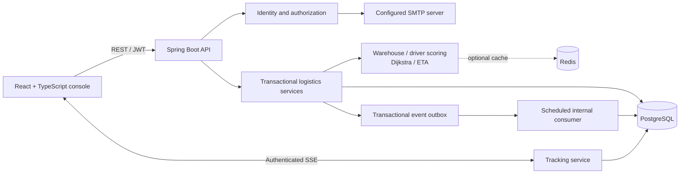

# FleetFlow
### Intelligent Logistics & Delivery Optimization Platform

A logistics operations platform that connects customer orders, warehouse inventory, driver assignment and delivery tracking. Built by extending the original Spring Boot backend in this repository.

FleetFlow focuses on the difficult part of fulfillment: ensuring that concurrent orders cannot reserve the same stock, retries cannot create duplicate work, and customers cannot access another customer's delivery.

## Implemented capabilities

- **Identity:** customer registration, BCrypt passwords, signed JWT access tokens, rotating refresh tokens, logout revocation, role and account management, forced password changes, and SMTP-backed password recovery.
- **Fulfillment:** multi-item orders, explainable warehouse selection, transactional reservations, state transitions, cancellation and return stock handling.
- **Fleet:** drivers, vehicles, availability, capacity checks and exclusive concurrent assignment.
- **Routing:** Dijkstra on supplied weighted graphs, nearest-neighbor multi-stop planning, geodesic shipment routes and speed/stop-based ETA.
- **Visibility:** authenticated server-sent events, driver position reports, shipment timelines, persisted analytics, alerts and audit records.
- **Reliability:** PostgreSQL constraints and row locks, retry keys with request fingerprints, an internal transactional outbox, optional Redis distance caching with failure fallback.
- **Console:** React operations and customer dashboards, orders, warehouses, inventory, products, fleet, tracking, routes, account administration and driver workspace.

**Scope:** this is a portfolio implementation, not a certified production logistics service. Routing uses geographic distance estimates; it has no road network or live traffic feed. One driver handles one active shipment at a time. See [limitations](#limitations-and-roadmap).

## Architecture



The backend uses explicit parameterized SQL through Spring JDBC. It does not use JPA or expose persistence entities. Request records validate API input; read endpoints return explicit projection maps. This makes lock acquisition and database constraints visible in the implementation.

## Stack

| Layer | Technology |
| --- | --- |
| Backend | Java 25, Spring Boot 4.1.1, Maven wrapper 3.9.16 |
| Persistence | PostgreSQL 18, Flyway |
| Security | Spring Security, Nimbus JWT, BCrypt |
| Frontend | React 19, TypeScript, Vite, Tailwind CSS, React Router, TanStack Query, Recharts |
| Runtime | Docker Compose, optional Redis 7.4, SMTP adapter |
| Verification | JUnit, real PostgreSQL integration tests, HTTP acceptance test, Playwright |

Frontend dependencies are pinned in `package-lock.json`. The existing Java/Spring versions were retained after verifying the installed JDK.

## Local setup

Requirements: JDK 25, Node 24, PostgreSQL, and optionally Redis or Docker Desktop. No globally installed Maven is needed.

1. Create the database using your own local administrator credentials:

   ```sh
   createdb -h localhost -U postgres fleetflow
   ```

2. Copy `.env.example` to `.env`. Set `DB_PASSWORD` and a randomly generated `JWT_SECRET` of at least 32 characters. Real credentials belong only in `.env` or your environment. `.env` is ignored by Git.

3. Start the backend from PowerShell:

   ```powershell
   $env:JAVA_HOME = 'C:\path\to\jdk-25'
   .\scripts\backend.ps1
   ```

   On Linux/macOS, export the variables in `.env`, then:

   ```sh
   cd backend
   ./mvnw spring-boot:run
   ```

4. Start the frontend in another terminal:

   ```sh
   cd frontend
   npm ci
   npm run dev
   ```

5. Open **http://localhost:5173**. Use this hostname consistently with `CORS_ORIGIN`; `127.0.0.1` is a different origin. API: http://localhost:8080. Swagger: http://localhost:8080/swagger-ui.html.

Flyway runs automatically on backend startup. There is no H2 fallback and no automatic schema recreation. PostgreSQL must be reachable.

### Demo records and initial accounts

For an intentional demo environment, set `DEMO_ENABLED=true` and `DEMO_PASSWORD` to a strong 12–72 character password, then start the backend once. Seeding occurs transactionally and is protected against duplicate startup. Set `DEMO_ENABLED=false` afterward. No default password is shipped.

The seed creates these clearly marked demo accounts:

| Email | Role |
| --- | --- |
| `admin@fleetflow.demo` | ADMIN |
| `operator@fleetflow.demo` | OPERATOR |
| `driver@fleetflow.demo` | DRIVER |
| `customer@fleetflow.demo` | CUSTOMER |

All use the configured `DEMO_PASSWORD`. The seed also creates warehouses, stock, vehicles, drivers and six orders using the actual service layer. Dashboard figures are calculated from those persisted records. The seed never rewrites an existing demo account's password.

Without demo seeding, registration creates CUSTOMER accounts only. Initial production administrator provisioning requires an explicit controlled database operation; there is no public admin-registration endpoint.

### Environment configuration

| Variable | Purpose |
| --- | --- |
| `DB_HOST`, `DB_PORT`, `DB_NAME` | PostgreSQL location; defaults localhost, 5432, fleetflow |
| `DB_USERNAME`, `DB_PASSWORD` | Database credentials; password required |
| `JWT_SECRET` | HMAC signing key, at least 32 random characters |
| `CORS_ORIGIN` | Exact frontend origin, default http://localhost:5173 |
| `REDIS_HOST`, `REDIS_PORT` | Optional distance cache, default localhost:6379 |
| `DEMO_ENABLED`, `DEMO_PASSWORD` | Explicit demo seeding switch and password |
| `MAIL_ENABLED`, `MAIL_FROM` | Enable recovery email and configure sender |
| `SMTP_HOST`, `SMTP_PORT` | SMTP server; local development default localhost:1025 |
| `SMTP_USERNAME`, `SMTP_PASSWORD`, `SMTP_AUTH`, `SMTP_TLS` | SMTP authentication and TLS settings |

Email recovery responds with a clear 503 when email delivery is unconfigured. Reset tokens are hashed in PostgreSQL, never returned by the API, and delivered only through configured SMTP. No email service is bundled.

### Redis

Redis caches immutable coordinate-distance results for one hour. PostgreSQL remains authoritative for inventory, assignments, auth and shipment state. If Redis fails, the calculation runs locally and the cache is bypassed for 30 seconds. Core readiness does not depend on Redis. Use Compose for a local Redis service or configure an existing instance.

## Docker

```sh
docker compose config --quiet
docker compose up --build -d
```

Compose provides PostgreSQL, Redis, backend and frontend. The frontend is available on localhost:5173 and the API on localhost:8080. Stop native development servers first to free those ports. Container PostgreSQL is exposed on localhost:5433 to avoid the native PostgreSQL port and uses its own persistent named volume. It does **not** reuse the native database's records.

Do not use `docker compose down -v` unless you intend to delete the container database. See [deployment](docs/deployment.md) for AWS mapping, secrets and operational constraints.

## Verification

```powershell
$env:JAVA_HOME = 'C:\path\to\jdk-25'
.\scripts\backend.ps1 verify
```

```sh
cd frontend
npm ci
npm run build
```

The backend tests require a reachable PostgreSQL database and credentials from the environment. They create a randomly named `ff_test_...` schema, migrate it, and remove that schema afterward. They never truncate development tables. GitHub Actions provides an ephemeral PostgreSQL service for this purpose.

Browser tests require Chrome, running local servers, seeded demo accounts and `DEMO_PASSWORD` in the test process environment:

```sh
cd frontend
npx playwright test
```

Coverage includes state transition rules, scoring, shortest paths, ETA, inventory contention, duplicate requests, assignment contention, return/cancellation behavior, auth rotation, ownership checks, Redis failure fallback and a customer-to-delivery HTTP workflow. Check [verification](docs/verification.md) for the actual latest executed results and environment limitations.

## Algorithms and concurrency

Warehouse selection excludes unavailable/full warehouses and requires all requested items to be available at one warehouse. A normalized score combines distance, utilization, priority and SLA risk. Driver selection requires an available driver and vehicle, zero workload and sufficient weight capacity. Scoring is an explainable heuristic, **not machine learning**.

Orders, reservations, load changes, audit entries, events and retry records commit together. Allocations lock candidate warehouse rows in UUID order, then inventory rows in product order. Assignment locks the order, ranks eligible drivers, then locks and rechecks one candidate driver/vehicle pair at a time. Database constraints provide an additional layer of protection. See [algorithms](docs/algorithms.md) and [concurrency](docs/concurrency.md).

## Engineering documentation

- [Architecture](docs/architecture.md)
- [Algorithms and limitations](docs/algorithms.md)
- [Database model and migrations](docs/database.md)
- [API guide](docs/api.md)
- [Concurrency and retry guarantees](docs/concurrency.md)
- [Security model](docs/security.md)
- [Deployment and observability](docs/deployment.md)
- [Initial inspection](docs/inspection.md)
- [Executed verification](docs/verification.md)

## Limitations and roadmap

- Geographic routes are direct-distance estimates, not road navigation. Add a real road graph or routing provider before operational use; traffic prediction is not implemented.
- Warehouses fulfill an order in full; split shipments and physical storage-volume optimization are not implemented. Capacity represents simultaneous fulfillment slots.
- Drivers carry one active shipment. A failed delivery retains stock and assignment until the return is recorded.
- SSE polls persisted state every three seconds, sends only changes, and reconnects at one minute. It is bounded to 64 connections per instance; it is not a broker-backed high-volume tracking service.
- Redis caches distances only. API rate limits are per application instance and source address; multi-replica production needs trusted proxy configuration and a shared limiter.
- The UI keeps tokens in memory, so a full page reload requires signing in again. Refresh tokens rotate during the active session.
- SMTP delivery requires an external service. Real email delivery remains unverified; local container builds/startup have been verified.
- Analytics use recorded data without synthetic history. Fresh seeds therefore show a single day of activity.
- No AWS deployment, Kubernetes, forecasting, traffic-aware ETA, Prometheus/Grafana or OpenTelemetry deployment is included.

Priorities after the core workflow: richer catalog editing, scalable warehouse candidate pruning, road-network integration, reliable external notifications, shared rate limits, Testcontainers when Docker is available, and measured load testing.

## Contributing and project status

See [CONTRIBUTING](CONTRIBUTING.md), [security reporting](SECURITY.md), [community conduct](CODE_OF_CONDUCT.md) and [CHANGELOG](CHANGELOG.md). The implemented capabilities are listed above; executed checks and unverified infrastructure are separated in [verification](docs/verification.md). Road-network routing, batch vehicle routing and ML remain roadmap items, not implemented or experimental services.

The route screen now supports live nearest-neighbor planning for up to 50 stops. Request errors include a correlation ID, API bodies are bounded to 256 KiB, and an additive migration indexes ownership, token revocation and shipment-driver lookups. CI includes container builds and real browser workflows in addition to backend/PostgreSQL tests and frontend compilation.

Suggested repository description: “Intelligent fleet and delivery optimization platform for managing vehicles, drivers, deliveries, routes, and constraint-aware logistics operations.” Suggested topics: `fleet-management`, `logistics`, `route-optimization`, `delivery-optimization`, `spring-boot`, `java`, `postgresql`, `docker`, `rest-api`, `optimization`. Metadata has not been changed remotely.
